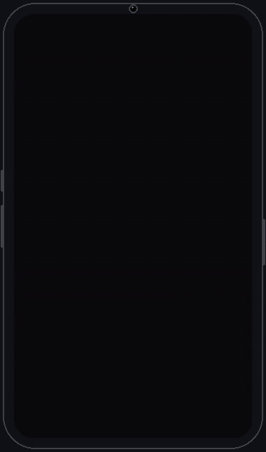
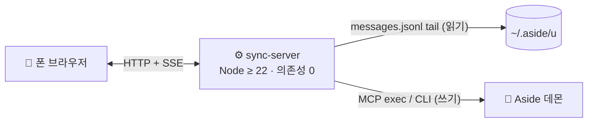

<div align="center">

# 🛰️ Remote Anything

**로컬 AI 에이전트 세션을 폰에서 이어서.**

책상에서 AI 에이전트에게 작업을 맡기고 집을 나서도, 지하철에서 계속 대화할 수 있다.
Remote Anything은 로컬 Aside 세션을 폰 브라우저로 이어주는 브리지다. 실시간 스트리밍,
페어링 코드 인증, macOS·Windows 상시 실행 킷을 갖추고 있다.

[](https://nodejs.org)
[](#-상시-실행)
[](#-빠른-시작)
[](LICENSE)
[](#-문서)

<p align="center"></p>

🎬 **[30초 소개 영상 고화질로 보기 (MP4)](assets/intro.mp4)**

[English](README.md) · **한국어**

<sub>비공식 커뮤니티 프로젝트이며 Aside와 제휴·보증 관계가 없다.</sub>

</div>

---

## ✨ 주요 기능

- 📱 **폰 우선 웹 클라이언트** — React 19 + Tailwind v4 + shadcn/ui로 만든 다크 모바일 UI. 모바일에서는 목록↔대화 전환, 데스크톱에서는 2페인.
- ⚡ **실시간 스트리밍** — 에이전트가 작동하는 동안 응답이 SSE로 채팅에 스트리밍된다. 상태 칩과 마지막 활동 시간이 함께 보인다.
- 📝 **같은 세션, 같은 transcript** — 원격에서 보낸 메시지가 로컬 Aside 세션에 그대로 기록된다. 포킹이나 복제 없음.
- 🔢 **6자리 페어링** — 코드는 터미널에 출력된다. IP당 분당 5회 제한, 20회 실패하면 재시작 전까지 잠금, 페어링 후 24시간 쿠키 유지.
- 🆕 **원격 새 세션** — 목록 헤더의 + 버튼 → 프로젝트 선택(없음/기존/새로 만들기) → 첫 메시지 → 시작.
- 🖥️ **상시 실행 킷** — macOS는 launchd 한 줄 등록, Windows는 예약 작업 + watchdog. 죽어도 다시 뜬다.
- 🌍 **사설망 외부 접속** — Tailscale과 조합하면 어느 네트워크에서든 HTTPS로 접속. 트래픽은 tailnet 밖으로 나가지 않는다.
- 📦 **의존성 0 서버** — Node ≥ 22 단일 프로세스. 서버는 `npm install`이 필요 없고, `web/dist`가 없어도 인라인 폴백 페이지로 응답한다.

## 🚀 빠른 시작

필요한 것: **macOS 또는 Windows** + Aside 앱(데몬 실행 중), **Node 22 이상**. 폰과 머신이 같은 네트워크에 있거나 Tailscale 같은 사설망 연결.

```sh
cd remote-anything
node server/sync-server.mjs --host 0.0.0.0 --port 8811   # LAN 접속
```

`--host`를 생략하면 `127.0.0.1`에만 바인딩한다(`tailscale serve` 뒤에 둘 때 적합).

터미널에 접속 가능한 주소와 6자리 **페어링 코드**가 출력된다:

1. 폰 브라우저에서 출력된 주소(`http://<머신 IP>:8811/`)로 접속한다.
2. 페어링 코드를 입력한다.
3. 세션 목록에서 이어 갈 세션을 고른다.
4. 메시지를 보내면 응답이 실시간으로 스트리밍된다.

새 세션도 만들 수 있다: + 버튼 → 프로젝트 선택 → 첫 메시지 → 시작.

## 🧭 동작 방식



- **읽기** — 서버는 각 세션의 네이티브 `messages.jsonl`(전체 엔벨로프, 무수정)을 tail해서 새 이벤트를 SSE로 브라우저에 밀어준다.
- **쓰기** — 원격 메시지는 Aside 자체 표면(MCP exec / CLI `session queue|stop`)으로 간다. 데몬 토큰은 추출하지 않는다. 폰에서 새 세션을 시작하거나 프로젝트를 만들 때는 Aside의 로컬 `state.db`에 몇 행을 쓴다(세션을 비휘발로 표시, 프로젝트 연결·생성).
- **인증** — 터미널에 출력된 6자리 페어링 코드가 단기 쿠키로 교환된다.

## 🖥️ 상시 실행

### macOS — launchd

KeepAlive로 죽어도 다시 뜬다(label `local.remote-anything.bridge`, 포트 8811, 로그 `~/Library/Logs/remote-anything.log`).

```sh
sh mac/install.sh                                                  # 설치 + 즉시 기동
tail -20 ~/Library/Logs/remote-anything.log | grep "Pairing code"     # 현재 페어링 코드
launchctl kickstart -k gui/$(id -u)/local.remote-anything.bridge     # 재시작
sh mac/uninstall.sh                                                # 제거
```

### Windows — 예약 작업 + watchdog

```powershell
cd windows
powershell -ExecutionPolicy Bypass -File install-task.ps1   # 로그온 자동 시작 + watchdog
powershell -ExecutionPolicy Bypass -File status.ps1         # 작업 상태 + 페어링 코드
powershell -ExecutionPolicy Bypass -File logs.ps1 -Follow   # 로그
```

자세한 운영법은 [windows/README.md](windows/README.md)를 참고한다.

## 🌍 외부 네트워크에서 접속 (Tailscale)

같은 Wi-Fi라면 그대로 쓴다. 밖에서는 서버를 tailnet 안의 HTTPS 주소로 프록시한다:

```sh
tailscale serve --bg --https=443 http://127.0.0.1:8811
```

폰에서 Tailscale VPN을 켜고 `https://<머신>.<tailnet>.ts.net`을 열면 된다. 어느 네트워크에서든 같은 페어링 코드로 접속하고, 인증서와 암호화는 Tailscale이 처리하며 serve 설정은 재부팅 후에도 유지된다.

> [!WARNING]
> **페어링 코드를 아는 사람은 이 머신의 Aside 세션을 전부 읽고 보낼 수 있다.**
> `--host 0.0.0.0`(상시 실행 킷의 기본값)은 암호화 없는 HTTP로 LAN에 연다. 믿을 수 있는 네트워크에서만 쓰고,
> 코드를 공유하지 말고, 외부 접속은 Tailscale 같은 사설망 경로로만 한다.

## 🛠️ 개발

`web/`은 Vite + React 19 + TypeScript + Tailwind v4 + shadcn/ui(zinc 다크) 클라이언트다. 서버는 `web/dist`를 정적으로 서빙하고, 빌드가 없으면 인라인 폴백 페이지로 응답한다.

```sh
cd web
npm install
npm run build     # web/dist 출력 — 서버가 즉시 서빙
npm run dev       # 개발 모드 (/api를 127.0.0.1:8811로 프록시)
```

세션 접근을 CLI로 확인할 때는 공식 Aside MCP만 쓰는 무의존성 도구([tools/probe.mjs](tools/probe.mjs))를 쓴다:

```sh
node tools/probe.mjs tools
node tools/probe.mjs create                        # 무해한 테스트 세션 생성
node tools/probe.mjs read <session-id>
node tools/probe.mjs resume <session-id> "프롬프트"
node tools/probe.mjs status <session-id>
node tools/probe.mjs stop <session-id>
```

## 📚 문서

| 문서 | 내용 |
| --- | --- |
| [web/DESIGN.md](web/DESIGN.md) | 웹 클라이언트 디자인 결정과 남은 부채 |
| [mac/README.md](mac/README.md) · [windows/README.md](windows/README.md) | 플랫폼별 설치 상세 |

## ⚠️ 면책

Remote Anything은 독립적인 비공식 프로젝트로, Aside와 제휴·보증·지원 관계가 없다. "Aside"는 호환 대상을
설명하기 위해서만 쓴다. Aside의 로컬 CLI·MCP 서버·디스크의 세션 파일에 의존하며, 이들은 안정된 공개 API가
아니므로 Aside 업데이트로 언제든 동작하지 않을 수 있다. 사용에 따른 책임은 사용자에게 있다.

## 📄 라이선스

[MIT](LICENSE)
