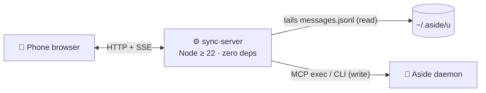

<div align="center">

# 🛰️ Remote Anything

**Continue your local AI-agent sessions from your phone.**

Start a task with your AI agent at your desk, walk out the door — and keep chatting
from the train. Remote Anything bridges your local Aside sessions to a phone browser
with live streaming, pairing-code auth, and always-on kits for macOS and Windows.

[](https://nodejs.org)
[](#-run-it-all-the-time)
[](#-quick-start)
[](LICENSE)
[](#-docs)

<p align="center"></p>

🎬 **[Watch the 30-second intro in high quality (MP4)](assets/intro.mp4)**

**English** · [한국어](README.ko.md)

<sub>An unofficial community project. Not affiliated with, endorsed by, or supported by Aside.</sub>

</div>

---

## ✨ Features

- 📱 **Phone-first web client** — a dark, mobile-safe UI built with React 19, Tailwind v4, and shadcn/ui. Session list swaps into chat on mobile; two panes on desktop.
- ⚡ **Real-time streaming** — replies stream into the chat over SSE while the agent works. Status chips and last-activity times keep the list honest.
- 📝 **Same transcript, same session** — messages sent from your phone are recorded into the local Aside session. Nothing is forked or duplicated.
- 🔢 **6-digit pairing** — the code prints in the terminal: rate-limited (5 attempts / min per IP, locked after 20 failures until restart) and a 24-hour cookie once paired.
- 🌐 **English & Korean UI** — follows your browser language; switch any time with the language button in the header.
- 🆕 **Start sessions remotely** — tap **+** in the list header, pick a project (none / existing / create new), and send the first message from your phone.
- 🖥️ **Always-on kits** — one command registers the server with launchd on macOS or a scheduled task + watchdog on Windows. Crashes come back on their own.
- 🌍 **Off-LAN ready** — pair it with Tailscale for HTTPS access from any network. Traffic never leaves your tailnet.
- 📦 **Zero-dependency server** — a single Node ≥ 22 process. No `npm install` for the server; without a `web/dist` build it still serves an inline fallback page.

## 🚀 Quick start

Requirements: **macOS or Windows** with the Aside app and its daemon running, and **Node ≥ 22**. Your phone and machine share a network (or a mesh like Tailscale).

```sh
cd remote-anything
node server/sync-server.mjs --host 0.0.0.0 --port 8811   # LAN access
```

Without `--host` the server binds to `127.0.0.1` only (useful behind `tailscale serve`). The terminal prints the reachable addresses and a 6-digit **pairing code**:

1. Open the printed address (`http://<machine-ip>:8811/`) in your phone's browser.
2. Enter the pairing code.
3. Pick a session from the list.
4. Send a message — the reply streams back live.

You can also start new sessions: **+** button → pick a project → first message → start.

## 🧭 How it works



- **Read side** — the server tails each session's native `messages.jsonl` (full envelopes, unmodified) and pushes new events to the browser over SSE.
- **Write side** — remote messages go through Aside's own surfaces (MCP exec / CLI `session queue|stop`). No daemon tokens are extracted. Starting a session or creating a project from the phone also writes a few rows to Aside's local `state.db` (marks the session non-ephemeral, links/creates the project).
- **Auth** — the 6-digit pairing code shown in the terminal exchanges for a short-lived cookie.

## 🖥️ Run it all the time

### macOS — launchd

Register with KeepAlive so the server comes back after a crash (label `local.remote-anything.bridge`, port 8811, log at `~/Library/Logs/remote-anything.log`):

```sh
sh mac/install.sh                                                  # install + start now
tail -20 ~/Library/Logs/remote-anything.log | grep "Pairing code"     # current pairing code
launchctl kickstart -k gui/$(id -u)/local.remote-anything.bridge     # restart
sh mac/uninstall.sh                                                # uninstall
```

### Windows — scheduled task + watchdog

```powershell
cd windows
powershell -ExecutionPolicy Bypass -File install-task.ps1   # auto-start on logon + watchdog
powershell -ExecutionPolicy Bypass -File status.ps1         # task status + pairing code
powershell -ExecutionPolicy Bypass -File logs.ps1 -Follow   # logs
```

See [windows/README.md](windows/README.md) for the full walkthrough.

## 🌍 Access from anywhere (Tailscale)

On the same Wi-Fi you are done. Outside, proxy the server into your tailnet as HTTPS:

```sh
tailscale serve --bg --https=443 http://127.0.0.1:8811
```

Then open `https://<your-machine>.<your-tailnet>.ts.net` from the phone with the Tailscale VPN on. The same pairing code works from any network, Tailscale handles the certificate and encryption, and the serve config survives reboots.

> [!WARNING]
> **Anyone who knows the pairing code can read and write every Aside session on this machine.**
> `--host 0.0.0.0` (used by the always-on kits) exposes it to your LAN over plain HTTP. Use it only on
> networks you trust, keep the code private, and reach the machine from outside only over a private
> mesh such as Tailscale.

## 🛠️ Development

`web/` is a Vite + React 19 + TypeScript + Tailwind v4 + shadcn/ui (zinc dark) client. The server serves `web/dist` statically and falls back to an inline page when the build is missing.

```sh
cd web
npm install
npm run build     # outputs web/dist — the server serves it immediately
npm run dev       # dev mode (proxies /api to 127.0.0.1:8811)
```

To verify session access from the CLI, use the zero-dependency probe ([tools/probe.mjs](tools/probe.mjs)), which talks only to the official Aside MCP:

```sh
node tools/probe.mjs tools
node tools/probe.mjs create                        # creates a harmless test session
node tools/probe.mjs read <session-id>
node tools/probe.mjs resume <session-id> "prompt"
node tools/probe.mjs status <session-id>
node tools/probe.mjs stop <session-id>
```

## 📚 Docs

| Document | What's inside |
| --- | --- |
| [web/DESIGN.md](web/DESIGN.md) | Web client design decisions and remaining debt |
| [mac/README.md](mac/README.md) · [windows/README.md](windows/README.md) | Platform setup details (Korean) |

## ⚠️ Disclaimer

Remote Anything is an independent, unofficial project. It is not affiliated with, endorsed by, or supported by
Aside; "Aside" is used only to describe compatibility. It relies on Aside's local CLI, MCP server, and on-disk
session files, which are not a stable public API — an Aside update can break it at any time. Use at your own risk.

## 📄 License

[MIT](LICENSE)
